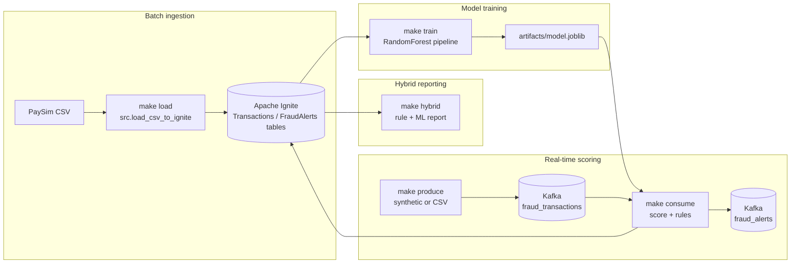

# Fraud Detection with Apache Ignite & Kafka

[](LICENSE)
[](requirements.txt)
[](docker-compose.yml)

A compact fraud-detection sandbox that loads PaySim-style transactions into **Apache Ignite**, trains a **RandomForest** baseline, and streams decisions through **Kafka**. Use it to practice data engineering workflows or to showcase a full ML+streaming path end-to-end.

---

## At a glance
- **Value**: end-to-end batch + streaming demo with reproducible Make targets and minimal dependencies.
- **Use cases**: capstone demo, quick recruiter walk-through, or a baseline to extend with better models.
- **Stack**: Python, scikit-learn, Apache Ignite, Kafka, Docker Compose.

## Architecture


*Full description in [docs/ARCHITECTURE.md](docs/ARCHITECTURE.md).* 

## Features
- PaySim-style CSV loader into Apache Ignite with schema enforcement.
- RandomForest + preprocessing pipeline saved to `artifacts/model.joblib` with printed metrics.
- Kafka producer for synthetic or CSV-backed transaction streams.
- Kafka consumer that applies rules + ML, writes alerts back to Kafka and Ignite.
- Hybrid report that re-scores suspicious Ignite rows with rule boosts.
- Make targets for one-command setup, data load, training, streaming, and teardown.

## One-minute quickstart
```bash
make up
make venv && make install
make load CSV=./data/transactions.csv LIMIT=100000   # optional if you have PaySim
make train                                            # requires labeled rows in Ignite
make consume THRESH=0.7                               # terminal A
make produce MODE=synthetic LIMIT=200 SLEEP_MS=25     # terminal B
make hybrid LIMIT=20
```
Prefer a helper? `./scripts/demo.sh` echoes the steps above and sends a short synthetic burst (assumes the consumer is already running).

## Detailed usage
### Batch ingest
- `make load CSV=./data/transactions.csv LIMIT=100000`
  - Uses `python -m src.load_csv_to_ignite` to insert rows into the `Transactions` table.
  - CSV must include PaySim columns; LIMIT caps ingestion for quick runs.

### Train the baseline model
- `make train` (or `python -m src.train --test-size 0.2 --random-state 42`)
  - Pulls labeled rows from Ignite, splits train/test, and prints confusion matrix, precision/recall/F1, PR-AUC.
  - Saves the pipeline to `artifacts/model.joblib` for downstream scoring.

### Stream and score
- Terminal A: `make consume THRESH=0.7`
  - Consumes Kafka topic `fraud_transactions`, applies SQL-inspired rules and ML threshold, writes alerts to Kafka `fraud_alerts` and the `FraudAlerts` Ignite table.
- Terminal B: `make produce MODE=synthetic LIMIT=200 SLEEP_MS=25`
  - Sends synthetic transactions by default. Use `MODE=csv CSV=./data/transactions.csv` to replay real data.

### Hybrid report
- `make hybrid LIMIT=20`
  - Pulls suspicious rows directly from Ignite, re-scores with the trained model, boosts rule hits to a minimum `final_risk` of 0.95, and prints a ranked table.

### Reset the stack
- `make reset` tears down Docker volumes and drops persisted Ignite/Kafka state.

## Configuration
- **Ports**: Kafka `9092`, Zookeeper `2181`, Apache Ignite thin client `127.0.0.1:10800` (bound to localhost for security).
- **Kafka bootstrap**: override with `KAFKA_BOOTSTRAP_SERVERS` env var or `--bootstrap` CLI flag. Defaults to `localhost:9092` (see `src/kafka_common.py`).
- **Ignite host/port**: defined in `src/config.py`; update if running Ignite remotely.
- **Data paths**: PaySim CSV is user-supplied (e.g., `./data/transactions.csv`). Models land in `./artifacts/model.joblib`.
- **Docker Compose**: adjust `docker-compose.yml` to change advertised listeners or port mappings.

## Outputs & generated assets
- `artifacts/model.joblib` — trained sklearn pipeline consumed by the consumer and hybrid report.
- Ignite tables: `Transactions` (ingested data) and `FraudAlerts` (alerts written by the consumer).
- Kafka topics: `fraud_transactions` (input) and `fraud_alerts` (output).
- Logs and tables printed by `make hybrid` showing merged rule + ML scores.

## Repository structure
```
fraud-detection-bigdata/
├─ README.md
├─ Makefile                # convenience targets (up, load, train, consume, produce, hybrid)
├─ docker-compose.yml      # Kafka, Zookeeper, Apache Ignite
├─ src/
│  ├─ load_csv_to_ignite.py  # CSV → Ignite loader
│  ├─ train.py               # RandomForest pipeline + metrics
│  ├─ produce.py / consume.py# Kafka producer & scoring consumer
│  ├─ hybrid.py              # rule + ML report from Ignite
│  └─ ignite_client.py       # thin client helpers
├─ scripts/demo.sh
└─ docs/
   ├─ ARCHITECTURE.md
   ├─ FAQ.md
   └─ DEMO.md
```

## Tech stack
- Python 3.11+, pandas, scikit-learn, joblib, tabulate
- Apache Ignite (thin client via `pyignite`)
- Apache Kafka (Bitnami distribution), Zookeeper
- Docker Compose for local orchestration
- Make for repeatable commands

## Evaluation & limitations
- Baseline **RandomForest** pipeline; metrics (confusion matrix, precision, recall, F1, PR-AUC) are printed during `make train` based on your data split.
- Requires labeled `isFraud` rows in Ignite; training fails fast if labels are missing or single-class.
- Streaming assumes localhost Kafka/Ignite; adjust bootstrap/ports if running remotely.
- Model serves as a baseline; real-world deployments should add drift monitoring, feature stores, and stronger governance.

## Troubleshooting
- **Port conflicts**: stop existing Kafka/Zookeeper/Ignite processes or change ports in `docker-compose.yml`.
- **Kafka advertised listeners**: if brokers advertise `localhost` but run elsewhere, set `KAFKA_BOOTSTRAP_SERVERS=<host>:9092` for producer/consumer.
- **Ignite connection refused**: ensure `make up` succeeded; `docker compose logs ignite-node` for errors.
- **`model.joblib` missing**: run `make train` after loading labeled data.
- **No labeled rows for training**: confirm CSV includes `isFraud`; use `LIMIT` to ingest enough labeled samples.
- **Reset everything**: `make reset` drops volumes and restarts with a clean slate.

## Roadmap
- Optional: add CI for lint/tests and container health checks.
- Extend model options (XGBoost/LightGBM) with hyperparameter presets.
- Add Grafana/Prometheus dashboards for alert monitoring.
- Publish ready-to-import sample PaySim slice for offline demos.

## License
Apache License 2.0 — see [LICENSE](LICENSE).

## References
- [PaySim](https://github.com/EdgarLopezPhD/paysim1) synthetic financial transactions dataset.
- [Apache Ignite](https://ignite.apache.org/) in-memory data grid used for storage and SQL rules.
- [Apache Kafka](https://kafka.apache.org/) event streaming backbone for producer/consumer flows.
