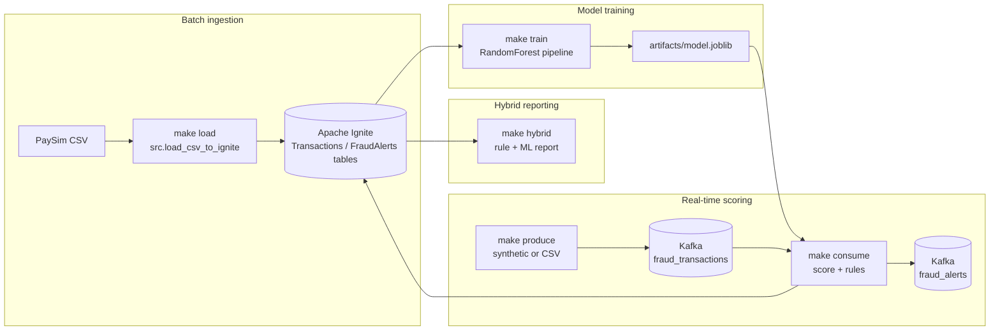

# Architecture

## Data flow
1. **Batch ingest**: a PaySim-style CSV is loaded into the `Transactions` table in Apache Ignite via the thin client.
2. **Training**: `make train` fetches labeled rows, trains a RandomForest pipeline, prints metrics, and writes `artifacts/model.joblib`.
3. **Streaming**: the Kafka producer publishes either synthetic events or replayed CSV rows to `fraud_transactions`. The consumer scores each event, applies rule checks, and emits alerts to both Kafka (`fraud_alerts`) and the Ignite `FraudAlerts` table.
4. **Hybrid reporting**: `make hybrid` queries suspicious rows from Ignite using SQL rules, re-scores with the trained model, boosts rule hits, and prints a ranked table.

## Components
- **Apache Ignite**: relational storage for transactions and alerts; also runs SQL to pre-filter suspicious rows.
- **Kafka**: transport for streaming transactions and downstream alerts.
- **Model artifacts**: `artifacts/model.joblib` holds the sklearn pipeline consumed by `make consume` and `make hybrid`.
- **Docker Compose**: orchestrates Kafka, Zookeeper, and Ignite locally.

## Extensibility
- Swap `build_pipeline` in `src/preprocess.py` to experiment with different estimators.
- Point `KAFKA_BOOTSTRAP_SERVERS` or `IGNITE_HOST`/`IGNITE_PORT` (in `src/config.py`) to external clusters.
- Add dashboards by subscribing to the `fraud_alerts` Kafka topic or querying Ignite.
